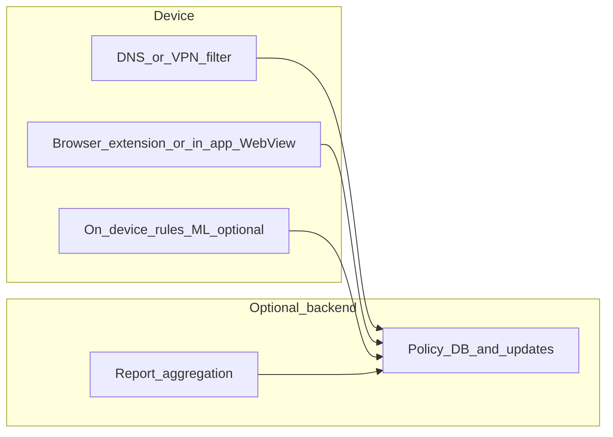
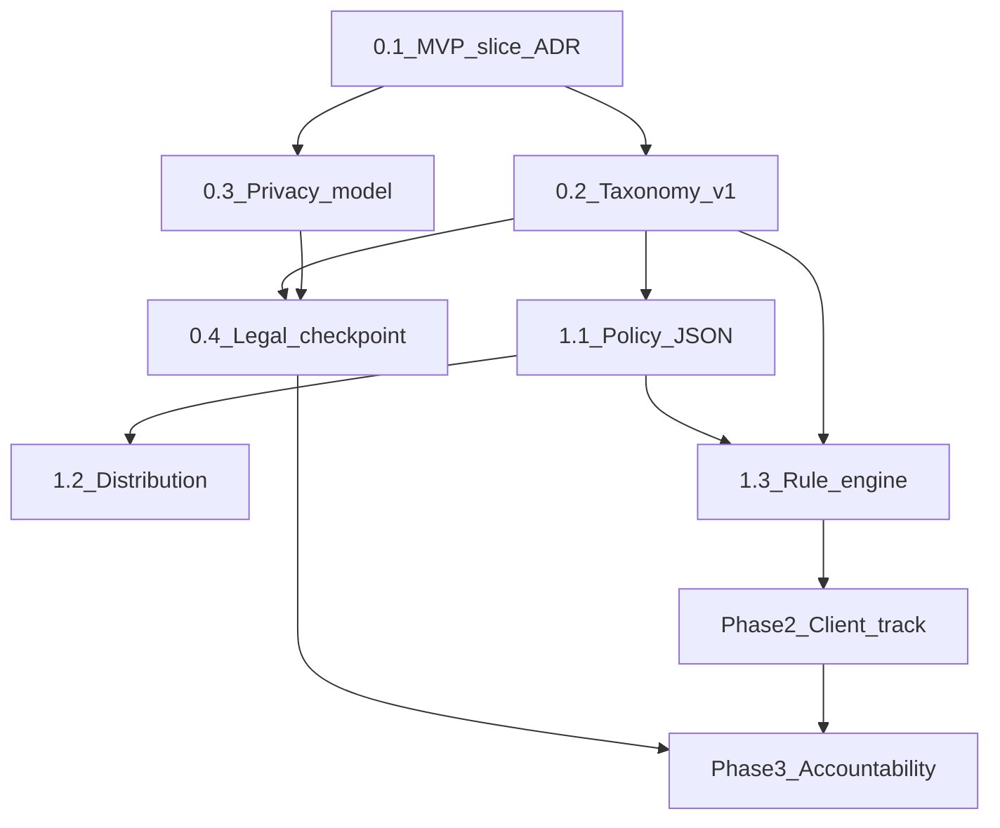

# Ethical ad filter on mobile: product and architecture

## Problem you are naming

Mobile ads are often optimized for conversion, not user welfare. When targeting or creative exploits **impulsivity, shame, urgency, or health-adjacent signals**, the harm is asymmetric: platforms and advertisers have data and scale; individuals do not. A “filter” is one layer; **accountability** requires evidence, standards, and channels that survive adversarial behavior.

## What “ethical filtering” must operationalize

You cannot block “unethical” in the abstract without a **policy model**:

- **Taxonomy**: categories you treat as high-risk (e.g., predatory lending, gambling urgency, weight-loss before/after shock, “limited time” pressure loops, recovery/disorder-adjacent triggers). Start narrow; expand with evidence.
- **Signals**: URL/domain lists, creative heuristics (OCR on rendered ad text where legal/technical), IAB/content labels where available, advertiser IDs, landing-page classification, optional user-supplied sensitivity (e.g., “gambling,” “alcohol,” “diet culture”).
- **Confidence tiers**: **block**, **warn/soft-blur**, **allow + log for reporting**—reduces false positives and legal exposure.

## Technical approaches (stacked defenses)

Mobile is fragmented; combine layers that fail gracefully.

1. **Network/DNS-level blocking** (Android-friendly; limited on iOS for system-wide behavior): block known bad domains/categories; fast; misses in-app encrypted ad calls without TLS interception (which is high-risk and often unacceptable).
2. **In-app / WebView / browser integration**: intercept ad SDK callbacks or use content blockers where the OS allows; better precision inside your own surfaces.
3. **On-device rules + optional lightweight ML**: classify landing-page snapshots or ad creative metadata when you legally can; keeps privacy higher if models run locally.
4. **User-controlled sensitivity profiles**: explicit opt-in categories beat paternalistic “we know your mental health” models—both ethically and for trust.

**Reality check**: Fully filtering **all** ads on a phone without OS cooperation or VPN/DNS is hard; iOS especially restricts system-wide interception. A credible MVP often starts as **DNS/VPN + browser** or as a **feature inside one app** you control.

## Accountability (holding companies to stated codes)

Technology alone rarely “holds accountable”; you need **evidence + narrative + jurisdiction**.

- **Capture for reporting**: structured logs (hashed identifiers, timestamp, category, creative hash, landing URL, policy clause allegedly violated)—with **clear consent** and **data minimization**.
- **Mapping to codes**: maintain a small public mapping from your taxonomy to **specific lines** in IAB frameworks, platform policies, or regional rules (e.g., UK/EU unfair commercial practices, FTC truth-in-advertising patterns)—lawyers should review any claims you publish.
- **Disclosure channels**: route bundles to platform ad transparency centers, regulators where appropriate, and (if nonprofit-aligned) advocacy partners—**not** as vigilante public shaming without process.
- **Adversarial robustness**: advertisers rotate domains and creatives; accountability data should emphasize **repeat offenders** and **network patterns**, not one-off URLs.

## Major risks and how to design around them

- **False positives**: blocking legitimate content (news, support orgs); use tiers and user override.
- **Legal**: terms of service for VPN/DNS apps, scraping, and storing ad evidence vary; don’t promise medical diagnosis or “detect mental illness.”
- **Privacy**: minimizing stored data is both ethical and reduces breach impact; prefer on-device classification when feasible.
- **Gaming the filter**: pure blocklists lose; combine signals, behavioral clustering of advertisers, and community/ expert review for category expansion.

## Suggested MVP slices (pick one to prove the thesis)

1. **Sensitivity-first DNS/VPN app**: ship strict lists for gambling/payday/high-pressure retail; transparent policy JSON; optional report export.
2. **Browser-only ethical layer**: extension or WebView hook with blur + “why blocked” tied to a policy ID.
3. **Research instrument**: opt-in panel that collects minimal evidence for a defined study (IRB/consent as needed)—strongest for **accountability** narrative, weakest for mass consumer adoption.

## What this plan deliberately does not claim

- That on-device filters can **fully** enforce ethics across every app without platform buy-in.
- That automated systems can reliably infer **individual** mental health status; design should avoid that and favor **user-declared sensitivities** and **category-based** protection.

## Next step if you later want implementation

When the workspace is available, a build plan would start from your actual stack (native vs cross-platform, whether you already have networking or WebViews) and choose one MVP slice above to avoid boiling the ocean.

## SusLink (TiltCheck monorepo: `c:\Users\jmeni\tiltcheck-monorepo\modules\suslink`): use cases for this project

**What it is today:** `@tiltcheck/suslink` is an **AI-assisted URL risk scanner** wired to TiltCheck’s event router. It exposes `suslink.scanUrl`, `quickCheck`, heuristics (risky TLDs, scam-like path keywords, casino typosquat/impersonation, redirect awareness, optional blacklist), and publishes `link.scanned` / `link.flagged` plus domain-trust updates. Existing call sites include the **API** (`apps/api` RGaaS routes), **Discord bot** (message URL auto-scan), and **Chrome extension** (via `safety/suslink/scan`). The module’s stated posture is closer to **“inform, don’t block”** than to broad ad ethics.

**Where it helps the ethical ad filter (composable signal, not the whole product):**

| Use case | Role | Notes |
| --- | --- | --- |
| **Landing URL triage** | When you have an ad click-through or resolved final URL, run SusLink (or `quickCheck` for cheap path) and **merge `riskLevel` + `reason` into policy tiers** (e.g. force *blur* or *block* when `high`/`critical`). | Legitimate brands can still run “urgent” creatives—SusLink won’t catch ethics-only harm; it **does** catch scam/phish/typosquat patterns that often ride alongside predatory promos. |
| **Evidence bundle (accountability)** | Attach **structured SusLink output** (risk level, reason, timestamp) to exports for platform/regulator packets. | Strengthens “this destination was objectively risky” without claiming mental-health inference. |
| **Domain trust feed** | Reuse **`emitDomainTrustFromScan`**-style signals so the policy JSON and blocklists align with TiltCheck’s trust graph where appropriate. | Requires defining ownership: same org → shared service; separate product → API contract. |
| **Feedback loop** | If users mark a false positive/negative, `link.feedback` patterns could eventually improve scanning—parallel to your taxonomy review. | Longer-term; not required for MVP. |

**What SusLink does *not* replace:** category rules for **impulse/urgency/shame**, **gambling volume**, **BNPL**, **diet culture**, etc. Those stay in your **taxonomy + policy JSON**. SusLink is an **additional orthogonal signal** on the **destination URL**.

**Integration options (pick in Phase 0 spike):**

1. **HTTP to existing TiltCheck API** (mirror Chrome extension): lowest coupling if mischiefmanager stays outside the monorepo; depends on auth, rate limits, and privacy (sending URLs to your backend).
2. **Workspace / package dependency** on `@tiltcheck/suslink`: feasible only if this app lives in or next to the monorepo; pulls in `@tiltcheck/event-router`, `@tiltcheck/ai-client`, etc.—heavier but offline-capable if you run a trimmed path.
3. **Fork or extract `LinkScanner` heuristics only**: if you need a tiny on-device evaluator without AI gateway—trade accuracy for size.

**Suggested Linear issues (add under Phase 1):**

- **Spike: SusLink signal contract** — Define mapping `LinkScanResult.riskLevel` → your tiers; document latency and when to use `quickCheck` vs `scanWithAI`.
- **Implement: landing-URL evaluation hook** — Call SusLink (or API) from the rule engine after URL normalization; unit tests for mapping.
- **Privacy: URL submission policy** — When URLs leave the device, update consent copy and retention (pairs with Phase 0 privacy task).

## Linear: breakdown and build order

**Created in workspace:** [Ethical ad filter — MVP](https://linear.app/tiltcheck/project/ethical-ad-filter-mvp-03a29bd944cb) · Epic [TIL-68](https://linear.app/tiltcheck/issue/TIL-68/epic-ethical-ad-filter-discovery-policy-engine-mvp-client) (team **Tiltcheck**, prefix **TIL**).

Use a **Linear Project** so the work stays scoped and roadmapped. Create one **parent issue** (epic container) and attach children with **blocked-by** links so sequencing is obvious in views.

### Recommended Linear structure

1. **Project (new)**: `Ethical ad filter — MVP`  
   - Description: Reduce high-harm ad exposure via user-controlled categories + transparent policy; optional accountability exports. Link to this plan doc if you keep it in-repo.

2. **Parent / epic issue** (no parent):  
   - **Title**: `[Epic] Ethical ad filter — discovery, policy engine, MVP client`  
   - **Description**: Top-level tracker; milestone checkboxes can mirror phases below.

3. **Labels** (create if missing): `ethics`, `privacy`, `policy`, `client`, `accountability`, `legal`, `spike`.

### Phase 0 — Decision and guardrails (start here)

| Order | Issue title | Intent | Blocked by |
| --- | --- | --- | --- |
| 0.1 | Spike: pick MVP slice (DNS/VPN vs browser/WebView vs research export) | ADR + non-goals; platform constraints (esp. iOS) | — |
| 0.2 | Taxonomy v1: 3–7 categories + tier definitions (block / blur / allow+log) | Operational definition of “unethical” for the product | 0.1 |
| 0.3 | Privacy & data model: minimization, retention, consent copy | GDPR/CCPA-minded; no inferred mental-health claims | 0.1 |
| 0.4 | Legal review checkpoint: ToS, reporting claims, store policies | Gate before public “accountability” language | 0.2, 0.3 |

### Phase 1 — Policy engine (ship the “brain” first)

| Order | Issue title | Intent | Blocked by |
| --- | --- | --- | --- |
| 1.1 | Policy artifact format (versioned JSON) + signing or integrity story | Safe updates; rollback | 0.2 |
| 1.2 | Policy distribution & update channel (CDN, in-app fetch, staging) | Reliable refresh without bricking clients | 1.1 |
| 1.3 | Rule evaluation library (tiers, overrides, user sensitivity profile merge) | Shared core for any client | 1.1, 0.2 |
| 1.4 | SusLink spike: API vs package vs heuristic-only; map `LinkScanResult` → tiers | Landing URL signal; see SusLink section | 0.1, 0.3 |
| 1.5 | SusLink integration in rule engine + privacy/consent for URL egress | Production hook + copy | 1.3, 1.4 |

### Phase 2 — MVP client (branch by slice; only one track is “must ship” for v1)

**Track A — DNS / VPN (Android-first)**

| Order | Issue title | Intent | Blocked by |
| --- | --- | --- | --- |
| A.1 | Blocklist pipeline: sources, dedupe, category tags | Operational lists tied to taxonomy | 1.1 |
| A.2 | Client integration: apply lists, metrics, failure modes | User-visible blocking | A.1, 1.3 |
| A.3 | QA: false positives + override UX | Trust + support load | A.2 |

**Track B — Browser / WebView**

| Order | Issue title | Intent | Blocked by |
| --- | --- | --- | --- |
| B.1 | Interception points (extension vs WebView hook) spike | Feasibility per platform | 0.1 |
| B.2 | Blur / block UI + “why” panel (policy ID → human text) | Transparency requirement | 1.3, B.1 |
| B.3 | Ship MVP surface + QA | End-to-end | B.2 |

**Track C — Research / accountability instrument**

| Order | Issue title | Intent | Blocked by |
| --- | --- | --- | --- |
| C.1 | Evidence bundle schema (hashes, timestamps, category, URLs) | Regulator/platform-ready packages | 0.3, 0.4 |
| C.2 | Opt-in capture path + export (no cloud until specified) | Ethics-first data collection | C.1 |
| C.3 | Map taxonomy → external policy citations (internal doc) | Accountability narrative | 0.4, C.1 |

### Phase 3 — Polish and accountability scale

| Order | Issue title | Intent | Blocked by |
| --- | --- | --- | --- |
| 3.1 | In-app “report” flow wired to evidence bundle | User-initiated accountability | Phase 2 winner + C.1 (or equivalent) |
| 3.2 | Repeat-offender / pattern reporting (aggregated) | Survive domain rotation | 3.1 |

### Dependency diagram (high level)

### Syncing to Linear (Cursor MCP)

The Linear integration can create/update issues with `save_issue` (team + title required; use `project`, `parentId`, `blockedBy` / `blocks` per the Linear MCP `save_issue` tool schema under `mcps/plugin-linear-linear/tools/save_issue.json` in the Cursor project). Suggested batch order:

1. `list_teams` → confirm **team** name for mischiefmanager.
2. Optionally `save_project` → create **Ethical ad filter — MVP** if it does not exist.
3. `save_issue` → create epic (parent).
4. `save_issue` → create Phase 0–3 issues with `parentId` = epic id and `blockedBy` per the table above.

**Plan-mode note:** Issue creation is a write; if the session is in plan-only mode, paste the tables above into Linear manually, or re-prompt with explicit permission to execute MCP writes (e.g. “create these issues in Linear now”).
